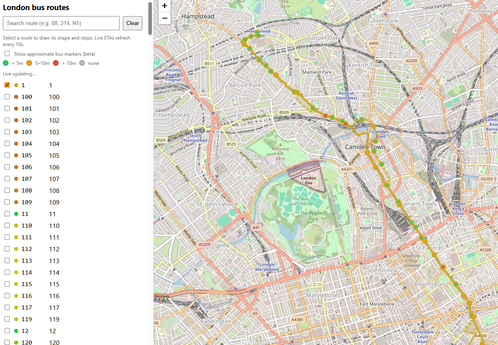

# London Bus RT — Live Route ETAs (Frontend + Tiny Backend)

**A lightweight, framework-free web app** that draws London bus routes and stops, then overlays **live ETAs** per stop. It’s designed to be stable and production-readable: no build tools, minimal code, and clean data plumbing. Optional “beta” markers can show approximate bus positions without glitchy tweening.

- **Live demo (Frontend):** **https://rorymansell.github.io/pub-transport-2/**
- **Backend (Render):** **https://pub-transport-2.onrender.com** - May need to activate if asleep
- **Tech:** HTML, CSS, JavaScript (vanilla), Leaflet, OpenStreetMap tiles  
- **APIs:** TfL Unified API (via a minimal proxy), OSM tiles

---

## 📸 Screenshot




---

## ✨ Why this is interesting

- **Real-time data integration:** consumes a public transport feed and presents live ETAs with clean visual semantics.
- **Geospatial fundamentals:** haversine distance, polyline interpolation, tangent-based heading, stop-to-geometry matching.
- **Lean delivery:** single HTML file + Leaflet; no bundler or framework required; deployable to GitHub Pages in minutes.
- **Operational pragmatism:** stable UX (no glitchy tweening), safe polling, hard cleanup of layers, cache-busting to avoid stale assets.

---

## ✅ Features

- Search and select multiple routes; draws inbound (solid) and outbound (dashed) polylines.
- Stop rings colored by **soonest incoming ETA** at that stop.
- Click a stop to see its name and direction.
- **Optional approximate bus markers (beta):** positions between prev→next stop using ETA heuristics (no animation to avoid snapbacks).
- Hard cleanup: unchecking a route removes its shapes, stops, and markers; clearing removes everything and halts polling.
- No build step; one static file deploy.

---

## 🧱 Architecture

**Frontend (Leaflet app)**
- Plain HTML/CSS/JS (no framework).
- Polls the backend every 10s.
- Renders:
  - Route polylines (inbound solid, outbound dashed)
  - Stop rings (recolored by nearest ETA)
  - Optional approximate bus markers

**Backend (Render)**
- Minimal proxy to the **TfL Unified API** and route geometry.
- Exposes a small, UI-friendly surface.

---

## 🌐 Data sources & APIs

### TfL Unified API (via backend proxy)
The app uses a tiny backend to call TfL and normalize responses:

- **Arrivals (predictions):** ETA to a **specific next stop** (seconds), plus `vehicle_id`, `direction`, `prev_stop_id`, `next_stop_id`.
- **Routes / shapes:** ordered stops and polyline segments for inbound/outbound directions.

> Important: TfL’s public feed does **not** include live bus GPS; markers are **inferred** along the route geometry from `prev_stop_id → next_stop_id` and `eta_seconds`.

### Backend endpoints

- `GET /routes` → list of routes:
  ```json
  [{ "id": "88", "name": "Clapham Common - Camden Town" }]
  ```

- `GET /line/{lineId}/shape` → polylines:
  ```json
  { "inbound": [ [[lat,lon],...], ... ], "outbound": [ ... ] }
  ```

- `GET /line/{lineId}/stops` → stop arrays (id, name, lat, lon).

- `GET /vehicles?line_id={lineId}` → vehicles array with:
  ```json
  {
    "vehicle_id": "12345",
    "route": "88",
    "direction": "inbound|outbound",
    "prev_stop_id": "4900...", "next_stop_id": "4900...",
    "prev_lat": 51.5, "prev_lon": -0.13,
    "next_lat": 51.51, "next_lon": -0.12,
    "next_stop_name": "Some Stop",
    "eta_seconds": 740
  }
  ```

### Map tiles
- **OpenStreetMap Standard** via Leaflet (`https://{s}.tile.openstreetmap.org/{z}/{x}/{y}.png`).  
  _For production scale, use a paid provider or your own cache and follow OSM tile usage policy._

---

## 🛠 Tech stack

- **Frontend:** HTML, CSS, JavaScript (vanilla), [Leaflet](https://leafletjs.com/)
- **Mapping / Geometry:** haversine distance, polyline interpolation, heading along tangent
- **APIs:** TfL Unified API (proxied), OpenStreetMap tiles
- **Hosting:** GitHub Pages (frontend), Render (backend)
- **DX:** cache-busting headers, hard layer cleanup, resilient polling lifecycle

---

## 🚀 Getting started

1. **Clone** the repo and open `index.html` in a browser (no build step).
2. Confirm the backend URL in the file:
   ```js
   const API = "https://pub-transport-2.onrender.com";
   ```
3. **Deploy to GitHub Pages:**
   - Push to `main`.
   - Enable Pages (deploy from `/root`).
   - Update the README “Live demo” link with your Pages URL.

> Pages caching: meta `no-cache` headers and `fetch(..., { cache: "no-store" })` are used to avoid stale assets.

---

## 🧠 Notes & trade-offs

- ETAs (`eta_seconds`) are **to the next stop**, not across the whole route.
- Long ETAs often mean the bus is far upstream or on terminal layover; markers intentionally avoid “racing” along a tiny final slice.
- OSM standard tiles are fine for demos; use a commercial provider for heavier traffic.

---

## 🗺 Roadmap (for a future iteration)

- Smooth tweened motion with debounced slice switching and projection continuity.
- Downstream stop ETAs per stop popup.
- Route/service health ribbon (minor delays/disruptions).
- Offline cache of shapes/stops for instant route toggling.

---

## 🔗 Links

- **Live demo (Frontend):** (https://rorymansell.github.io/pub-transport-2/)
- **Backend (Render):** https://pub-transport-2.onrender.com
- **Leaflet:** https://leafletjs.com/
- **TfL Unified API:** https://api.tfl.gov.uk/
- **OpenStreetMap:** https://www.openstreetmap.org/

---

## 🙏 Acknowledgements

- Transport for London (TfL) for open data.
- OpenStreetMap contributors and the Leaflet community.

---

## 📄 License

MIT — feel free to fork and adapt (please respect external API terms).
